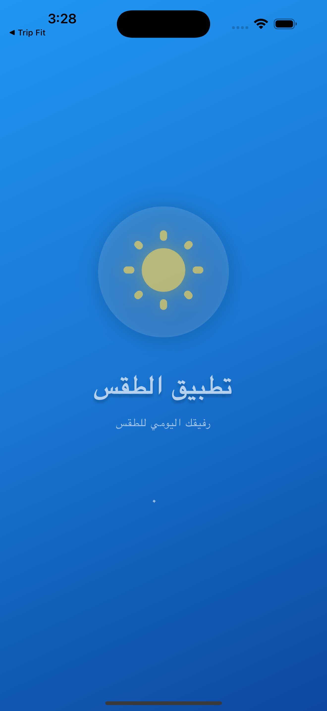
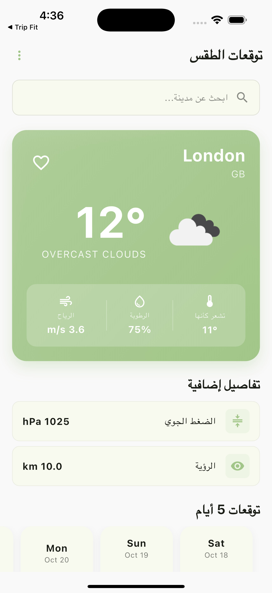
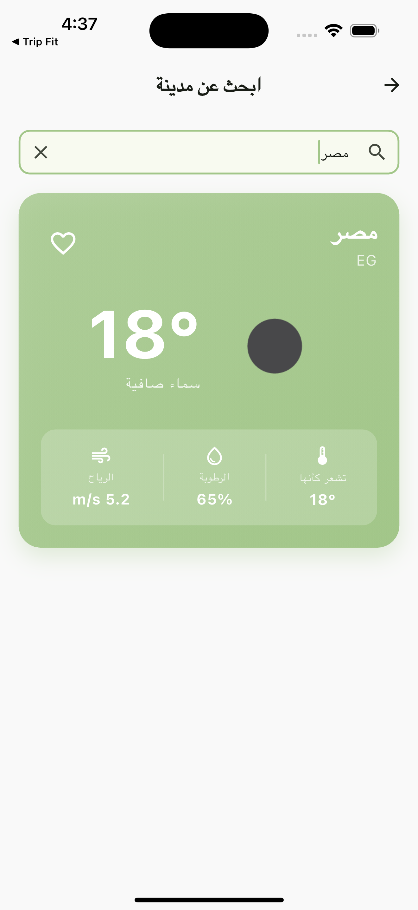
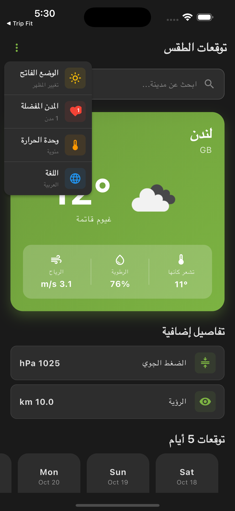

# 🌤️ Weather Forecast App

تطبيق طقس مميز مبني بـ Flutter يوفر معلومات الطقس الحالية والتوقعات لـ 5 أيام مع دعم كامل للغتين العربية والإنجليزية وإمكانية حفظ المدن المفضلة.

[](https://flutter.dev/)
[](https://dart.dev/)
[](LICENSE)

<div align="center">
  
  
</div>

---

## 📋 جدول المحتويات

- [نظرة عامة](#-نظرة-عامة)
- [الميزات](#-الميزات)
- [التقنيات المستخدمة](#️-التقنيات-المستخدمة)
- [بنية المشروع](#-بنية-المشروع)
- [البدء](#-البدء)
- [الإعداد](#️-الإعداد)
- [الاستخدام](#-الاستخدام)
- [لقطات الشاشة](#-لقطات-الشاشة)
- [التطويرات المستقبلية](#-التطويرات-المستقبلية)
- [المساهمة](#-المساهمة)
- [الترخيص](#-الترخيص)
- [تواصل معي](#-تواصل-معي)

---

## 🌟 نظرة عامة

تطبيق Weather Forecast هو تطبيق طقس شامل يوفر معلومات دقيقة عن الطقس من OpenWeatherMap API. التطبيق مصمم بعناية ليوفر تجربة مستخدم سلسة وجميلة مع دعم كامل للغتين العربية والإنجليزية.

**النقاط الرئيسية:**
- 🌍 بيانات طقس حقيقية من OpenWeatherMap API
- 📱 يعمل على iOS و Android 
- 🎨 تصميم جميل وعصري
- 🌓 دعم الوضع الليلي (Dark Mode) والنهاري (Light Mode)
- 🌐 دعم كامل للغة العربية والإنجليزية مع RTL
- 💾 حفظ المدن المفضلة محلياً (حتى 5 مدن)
- 🔍 بحث ذكي عن المدن مع تقنية Debouncing
- 🔄 تحديث الطقس بسحب الشاشة للأسفل (Pull-to-refresh)
- 🌡️ إمكانية التبديل بين وحدات الحرارة (سيليزيوس/فهرنهايت)

---

## ✨ الميزات

### الميزات الرئيسية

#### 🌡️ عرض الطقس الحالي
- درجة الحرارة الحالية والشعور بها (Feels Like)
- وصف حالة الطقس مع أيقونة
- نسبة الرطوبة
- سرعة الرياح
- الضغط الجوي
- مدى الرؤية
- أوقات الشروق والغروب

#### 📅 توقعات الطقس لـ 5 أيام
- توقعات يومية مفصلة
- درجات الحرارة العليا والدنيا
- وصف حالة الطقس لكل يوم
- أيقونات مرئية لحالة الطقس
- قائمة أفقية قابلة للتمرير

#### 🔍 البحث عن المدن
- بحث فوري عن أي مدينة في العالم
- تقنية Debouncing (500ms) لتقليل استدعاءات API
- عرض النتائج فوراً
- دعم البحث بصيغة "اسم المدينة, رمز الدولة"

#### ⭐ إدارة المدن المفضلة
- حفظ حتى 5 مدن مفضلة
- وصول سريع للمدن المفضلة
- عرض الطقس الحالي لكل مدينة مفضلة
- حذف من المفضلة بسهولة
- التخزين الدائم باستخدام Hive

#### 🌡️ تبديل وحدة الحرارة
- التبديل بين السيليزيوس والفهرنهايت
- حفظ التفضيل في التخزين المحلي
- تحويل فوري عبر جميع الشاشات

#### 🔄 ميزات إضافية
- تحديث الطقس بسحب الشاشة للأسفل
- معالجة الأخطاء برسائل واضحة
- حالات التحميل بأنيميشن سلس
- معالجة الحالات الفارغة

### ميزات تجربة المستخدم

#### 🎨 دعم الثيمات
- تبديل تلقائي بين الوضع الليلي والنهاري
- انتقالات سلسة بين الثيمات
- ألوان متناسقة ومريحة للعين

#### 🌐 الترجمة 
- دعم كامل للغة العربية
- دعم كامل للغة الإنجليزية
- دعم RTL للعربية
- تنسيقات التاريخ والوقت محلية
- وصف الطقس باللغة المختارة

#### 📱 تصميم متجاوب
- تخطيطات تتكيف مع أحجام الشاشات المختلفة
- تصميم Mobile-first
- تحسينات للتابلت والديسكتوب
- دعم الوضع الأفقي والعمودي

---

## 🛠️ التقنيات المستخدمة

### الإطار واللغة
- **Flutter** `3.32.8` - إطار عمل UI
- **Dart** `3.8.1` - لغة البرمجة

### إدارة الحالة
- **flutter_bloc** `^8.1.3` - مكون منطق الأعمال
- **bloc** `^8.1.2` - مكتبة إدارة الحالة

### الشبكة
- **dio** `^5.8.0+1` - عميل HTTP لاستدعاءات API
- **pretty_dio_logger** `^1.4.0` - تسجيل طلبات الشبكة

### التخزين المحلي
- **hive** `^2.2.3` - قاعدة بيانات NoSQL سريعة وخفيفة
- **hive_flutter** `^1.1.0` - تكامل Hive مع Flutter
- **flutter_secure_storage** `^9.2.4` - تخزين آمن للبيانات الحساسة

### واجهة المستخدم والتجربة
- **cached_network_image** `^3.2.3` - تخزين الصور مؤقتاً
- **shimmer** `^3.0.0` - تأثيرات التحميل
- **flutter_svg** `^2.0.7` - عرض صور SVG
- **lottie** `^2.0.1` - أنيميشن Lottie
- **animated_widgets_flutter** `^1.1.1+2` - أنيميشن مخصصة

### الأدوات المساعدة
- **get_it** `^7.6.0` - حقن التبعيات (Dependency Injection)
- **responsive_framework** `^1.5.1` - التصميم المتجاوب
- **intl** `^0.20.0` - التدويل والترجمة

### مكونات واجهة المستخدم
- **bot_toast** `^4.1.3` - إشعارات Toast
- **flutter_smart_dialog** `^4.9.8+9` - مربعات حوار ذكية
- **dotted_border** `^3.1.0` - حدود منقطة


### أدوات التطوير
- **flutter_lints** `^5.0.0` - قواعد Linting
- **hive_generator** `^2.0.0` - مولدات محولات أنواع Hive
- **build_runner** `^2.4.6` - توليد الكود

---

## 📁 بنية المشروع

التطبيق مبني باستخدام بنية منظمة تفصل المسؤوليات بوضوح:

```
lib/
├── core/                              # الأدوات والإعدادات الأساسية
│   ├── app_strings/                   # النصوص الثابتة
│   ├── config/                        # إعدادات التطبيق ومفاتيح API
│   │   └── key.dart                   # مفتاح OpenWeatherMap API
│   ├── data_source/                   # مصادر البيانات
│   │   ├── dio_helper.dart            # خدمة Dio و ApiResponse
│   │   ├── hive_helper.dart           # مساعدات Hive
│   │   └── hive_service.dart          # خدمة Hive الأساسية
│   ├── extensions/                    # امتدادات Dart
│   │   ├── context_extensions.dart    # امتدادات Context
│   │   ├── date_time_extensions.dart  # امتدادات DateTime
│   │   └── string_extensions.dart     # امتدادات String
│   ├── general/                       # Cubit العام للتطبيق
│   │   ├── general_cubit.dart         # إدارة الثيم واللغة ووحدة الحرارة
│   │   └── general_state.dart         # حالات GeneralCubit
│   ├── localization/                  # الترجمة والتوطين
│   │   ├── generated/                 # ملفات الترجمة المولدة تلقائياً
│   │   ├── l10n/                      # ملفات ARB (العربية/الإنجليزية)
│   │   └── localization_helper.dart   # مساعد الترجمة
│   ├── resources/                     # موارد التطبيق
│   │   ├── font_manager.dart          # إدارة الخطوط
│   │   └── text_style_manager.dart    # أنماط النصوص
│   ├── Router/                        # التنقل
│   │   ├── Router.dart                # تعريف المسارات
│   │   ├── navigation_helper.dart     # مساعد التنقل
│   │   └── logging_route_observer.dart # مراقبة المسارات
│   ├── services/                      # خدمات التطبيق
│   │   ├── alerts.dart                # إشعارات وSnackbars
│   │   └── navigation_service.dart    # خدمة التنقل
│   ├── style/                         # الثيمات
│   │   ├── app_theme.dart             # إعدادات الثيم
│   │   ├── base_theme.dart            # الثيم الأساسي
│   │   ├── dark_mode/                 # ثيم الوضع الليلي
│   │   │   └── dark_theme_colors.dart
│   │   └── light_mode/                # ثيم الوضع النهاري
│   │       └── light_theme_colors.dart
│   └── utils/                         # أدوات مساعدة
│       ├── general_constants.dart     # ثوابت التطبيق
│       ├── Locator.dart               # إعداد حقن التبعيات (GetIt)
│       ├── responsive.dart            # أدوات التصميم المتجاوب
│       └── utils.dart                 # دوال مساعدة عامة
│
├── features/                          # وحدات الميزات
│   ├── splash/                        # ميزة شاشة البداية
│   │   ├── cubit/                     # إدارة حالة Splash
│   │   │   ├── splash_cubit.dart
│   │   │   └── splash_states.dart
│   │   ├── domain/                    # منطق الأعمال
│   │   │   ├── model/
│   │   │   ├── repository/
│   │   │   └── request/
│   │   └── presentation/              # طبقة UI
│   │       └── screens/
│   │           └── splash/
│   │               └── splash.dart
│   │
│   └── weather/                       # ميزة الطقس
│       ├── cubit/                     # إدارة حالة الطقس
│       │   ├── weather_cubit.dart     # منطق الطقس الرئيسي
│       │   └── weather_states.dart    # حالات الطقس
│       ├── domain/                    # منطق الأعمال
│       │   ├── model/                 # نماذج البيانات
│       │   │   ├── weather_model.dart # بيانات الطقس الحالي
│       │   │   ├── forecast_model.dart # بيانات التوقعات
│       │   │   ├── favorite_city_model.dart # بيانات المدن المفضلة
│       │   │   └── favorite_city_model.g.dart # محول Hive
│       │   └── repository/            # طبقة المستودع
│       │       ├── weather_repository.dart # منطق API
│       │       └── endpoints.dart     # نقاط النهاية للAPI
│       └── presentation/              # طبقة UI
│           ├── screens/               # الشاشات
│           │   ├── home_screen.dart   # الشاشة الرئيسية
│           │   ├── search_screen.dart # شاشة البحث
│           │   └── favorites_screen.dart # شاشة المفضلة
│           └── widgets/               # مكونات مخصصة
│               ├── current_weather_card.dart # بطاقة الطقس الحالي
│               ├── forecast_item.dart # عنصر التوقعات
│               ├── favorite_city_card.dart # بطاقة المدينة المفضلة
│               ├── weather_detail_row.dart # صف تفاصيل الطقس
│               ├── weather_empty_widget.dart # حالة فارغة
│               ├── weather_error_widget.dart # حالة خطأ
│               └── weather_popup_menu.dart # قائمة الإعدادات
│
├── shared/                            # مكونات مشتركة
│   ├── widgets/                       # ويدجت مشتركة
│   │   ├── button_widget.dart         # أزرار مخصصة
│   │   ├── edit_text_widget.dart      # حقول إدخال
│   │   ├── loadinganderror.dart       # حالات التحميل والخطأ
│   │   └── empty_widget.dart          # حالة فارغة
│   ├── back_widget.dart               # زر الرجوع
│   └── base_stateless.dart            # Widget أساسي
│
└── main.dart                          # نقطة بداية التطبيق
```

### الأدلة الرئيسية

- **`core/`**: يحتوي على جميع المكونات القابلة لإعادة الاستخدام والإعدادات والأدوات المساعدة
  - `data_source/`: خدمات Dio و Hive
  - `general/`: إدارة الثيم واللغة ووحدة الحرارة
  - `localization/`: إدارة الترجمة بين العربية والإنجليزية
  - `Router/`: إدارة التنقل بين الشاشات
  - `style/`: إدارة الثيمات (Dark/Light)

- **`features/`**: وحدات الميزات منفصلة
  - `splash/`: شاشة البداية
  - `weather/`: جميع ميزات الطقس (الرئيسية، البحث، المفضلة)

- **`shared/`**: مكونات مشتركة تستخدم عبر التطبيق

---

## 🚀 البدء

### المتطلبات الأساسية

قبل البدء، تأكد من تثبيت:

- Flutter SDK 3.32.8 أو أحدث
- Dart SDK 3.8.1 أو أحدث
- Android Studio / Xcode (لتطوير الموبايل)
- VS Code أو Android Studio (محررات موصى بها)
- حساب في OpenWeatherMap للحصول على API Key

### التثبيت

1. **استنساخ المشروع**

```bash
git clone https://github.com/sayedashrf/task_flutter.git
cd task_flutter
```

2. **تثبيت التبعيات**

```bash
flutter pub get
```

3. **إنشاء الملفات المطلوبة**

```bash
# إنشاء محولات أنواع Hive
dart run build_runner build --delete-conflicting-outputs

# إنشاء ملفات الترجمة
flutter gen-l10n
```

4. **تشغيل التطبيق**

```bash
# للتطوير
flutter run

# لمنصة معينة
flutter run -d chrome        # Web
flutter run -d ios          # iOS
flutter run -d android      # Android
```

---

## ⚙️ الإعداد

### 1. مفتاح OpenWeatherMap API

التطبيق يستخدم OpenWeatherMap API للحصول على بيانات الطقس.

1. زر [OpenWeatherMap](https://openweathermap.org/api)
2. سجل حساب مجاني
3. احصل على API Key
4. أضف المفتاح في الملف:

```dart
// lib/core/config/key.dart
class ConstKeys {
  static const String weatherApiKey = 'YOUR_API_KEY_HERE';
}
```

**ملاحظة:** المفتاح الموجود حالياً في المشروع هو:
```dart
static const String weatherApiKey = 'cdded2f02b061824a5ec0c7fb293b750';
```

### 2. إعداد البيئة

ملف `env.json` للبيئات المختلفة:

```json
{
  "BASE_URL": "https://api.openweathermap.org/data/2.5",
  "BASE_URL_DEV": "https://api.openweathermap.org/data/2.5"
}
```

### 3. الترجمة

التطبيق يدعم العربية والإنجليزية:

- الترجمات العربية: `lib/core/localization/l10n/app_ar.arb`
- الترجمات الإنجليزية: `lib/core/localization/l10n/app_en.arb`

لإضافة لغة جديدة:
1. أنشئ ملف ARB جديد (مثل `app_fr.arb`)
2. أضف الترجمات
3. شغل `flutter gen-l10n`

### 4. إعدادات البناء

#### البناء للتطوير (Debug)
```bash
flutter run
```

#### البناء للإصدار (Android)
```bash
flutter build apk --release
```

#### البناء للإصدار (iOS)
```bash
flutter build ipa --release
```

---

## 💻 الاستخدام

### التنقل في التطبيق

1. **شاشة البداية (Splash)**: تظهر عند فتح التطبيق
2. **الشاشة الرئيسية (Home)**: 
   - عرض الطقس الحالي للمدينة الافتراضية (London)
   - توقعات الطقس لـ 5 أيام
   - المدن المفضلة (إن وجدت)
3. **البحث**: اضغط على أيقونة البحث للبحث عن أي مدينة
4. **المفضلة**: اضغط على أيقونة القلب لإضافة/حذف من المفضلة
5. **القائمة**: اضغط على أيقونة القائمة لتغيير:
   - الثيم (فاتح/داكن)
   - اللغة (عربي/إنجليزي)
   - وحدة الحرارة (سيليزيوس/فهرنهايت)

### استخدام ميزات الطقس

#### البحث عن مدينة
```dart
// من الكود
await weatherCubit.searchCity('Cairo');

// أو من واجهة المستخدم
// اضغط على أيقونة البحث واكتب اسم المدينة
```

#### الحصول على الطقس الحالي
```dart
await weatherCubit.getCurrentWeather('New York');
```

#### إدارة المفضلة
```dart
// إضافة للمفضلة
await weatherCubit.addToFavorites(weatherModel);

// حذف من المفضلة
await weatherCubit.removeFromFavorites(favoriteCityModel);

// التحقق من وجود مدينة في المفضلة
bool isFav = weatherCubit.isFavorite('London');
```

### إدارة الحالة

التطبيق يستخدم BLoC/Cubit:

```dart
// الاستماع لحالات الطقس
BlocBuilder<WeatherCubit, WeatherStates>(
  builder: (context, state) {
    if (state is CurrentWeatherLoadingState) {
      return LoadingWidget();
    } else if (state is CurrentWeatherSuccessState) {
      return WeatherDisplay();
    } else if (state is CurrentWeatherErrorState) {
      return ErrorWidget(state.message);
    }
    return Container();
  },
)
```

---

## 📸 لقطات الشاشة

لعرض لقطات الشاشة في هذا الملف، قم بإضافة 6 صور في مجلد `screenshots/` بالأسماء التالية:

### أسماء الصور المطلوبة:

1. **`splash_screen.png`** - شاشة البداية (Splash Screen)
2. **`home_screen_light.png`** - الشاشة الرئيسية في الوضع النهاري (Light Mode)
3. **`home_screen_dark.png`** - الشاشة الرئيسية في الوضع الليلي (Dark Mode)
4. **`search_screen.png`** - شاشة البحث عن المدن
5. **`favorites_screen.png`** - شاشة المدن المفضلة
6. **`popup_menu.png`** - القائمة المنبثقة (الإعدادات: الثيم، اللغة، وحدة الحرارة)

بعد إضافة الصور، سيتم عرضها هنا تلقائياً:

<div align="center">

### شاشات التطبيق

| الشاشة | الوصف |
|:------:|:--------|
|  | **شاشة البداية** - أول شاشة تظهر عند فتح التطبيق |
|  | **الشاشة الرئيسية - الوضع النهاري** - عرض الطقس الحالي والتوقعات |
|  | **الشاشة الرئيسية - الوضع الليلي** - نفس الشاشة بثيم داكن |
|  | **شاشة البحث** - البحث عن أي مدينة في العالم |
|  | **شاشة المفضلة** - قائمة المدن المحفوظة (حتى 5 مدن) |
|  | **قائمة الإعدادات** - تغيير الثيم واللغة ووحدة الحرارة |

</div>

### ميزات التطبيق في الصور:

✅ **شاشة البداية**: أنيميشن جميل عند فتح التطبيق  
✅ **الطقس الحالي**: درجة الحرارة، الوصف، الأيقونة  
✅ **توقعات 5 أيام**: قائمة أفقية قابلة للتمرير  
✅ **المفضلة**: حفظ حتى 5 مدن مع الطقس الحالي  
✅ **البحث**: بحث سريع مع Debouncing  
✅ **الوضع الليلي**: ثيم داكن مريح للعين  
✅ **الوضع النهاري**: ثيم فاتح نظيف  
✅ **الإعدادات**: تغيير سهل للثيم واللغة والوحدة  

---

## 🔮 التطويرات المستقبلية

### ميزات مخطط لها

- [ ] **خدمات الموقع**: الحصول على الطقس تلقائياً حسب الموقع الحالي
- [ ] **إشعارات الطقس**: تنبيهات للطقس القاسي
- [ ] **توقعات بالساعة**: توقعات مفصلة ساعة بساعة
- [ ] **الدعم غير المتصل**: حفظ آخر بيانات طقس تم جلبها
- [ ] **خرائط الطقس**: خرائط مرئية للطقس والرادار
- [ ] **مقارنة المدن**: مقارنة الطقس بين عدة مدن
- [ ] **ويدجت الشاشة الرئيسية**: ويدجت للطقس على الشاشة الرئيسية
- [ ] **مؤشر UV**: معلومات عن مؤشر الأشعة فوق البنفسجية
- [ ] **جودة الهواء**: معلومات عن جودة الهواء والتلوث

### تحسينات تقنية

- [ ] تنفيذ اختبارات الوحدة (Unit Tests)
- [ ] إضافة اختبارات الويدجت (Widget Tests)
- [ ] تنفيذ اختبارات التكامل (Integration Tests)
- [ ] إضافة CI/CD Pipeline (GitHub Actions)
- [ ] تحسين ميزات إمكانية الوصول
- [ ] إضافة التحليلات (Firebase Analytics)
- [ ] تنفيذ تقارير الأعطال (Firebase Crashlytics)
- [ ] تحسين حجم التطبيق
- [ ] تنفيذ Deep Linking
- [ ] إضافة اختصارات التطبيق

### تحسينات UI/UX

- [ ] خلفيات متحركة للطقس
- [ ] تأثيرات جزيئات لحالات الطقس (مطر، ثلج، إلخ)
- [ ] انتقالات سلسة بين الصفحات
- [ ] تأثيرات تمرير Parallax
- [ ] أنيميشن تحميل متقدمة
- [ ] تفاعلات دقيقة (Micro-interactions)
- [ ] ردود الفعل اللمسية (Haptic Feedback)
- [ ] أيقونات طقس مخصصة
- [ ] البحث الصوتي
- [ ] تحسينات إمكانية الوصول

---

## 🧪 الاختبار

### تشغيل الاختبارات

```bash
# تشغيل جميع الاختبارات
flutter test

# تشغيل الاختبارات مع التغطية
flutter test --coverage

# تشغيل ملف اختبار معين
flutter test test/widget_test.dart
```

### قائمة فحص الاختبار اليدوي

- [ ] البحث عن عدة مدن
- [ ] إضافة مدن للمفضلة (اختبار حد 5 مدن)
- [ ] حذف مدن من المفضلة
- [ ] وظيفة السحب للتحديث
- [ ] عرض توقعات 5 أيام
- [ ] التبديل بين اللغات (العربية/الإنجليزية)
- [ ] اختبار الوضع الليلي/النهاري
- [ ] التبديل بين سيليزيوس/فهرنهايت
- [ ] الاختبار على أحجام شاشات مختلفة
- [ ] الاختبار بدون اتصال بالإنترنت
- [ ] الاختبار بأسماء مدن غير صحيحة
- [ ] اختبار معالجة الأخطاء

### مدن للاختبار

استخدم هذه المدن للاختبار الشامل:
- London, UK
- Cairo, EG
- New York, US
- Tokyo, JP
- Dubai, AE
- Paris, FR
- Sydney, AU
- Moscow, RU
- Istanbul, TR
- Mumbai, IN

---

## 🤝 المساهمة

المساهمات مرحب بها! إليك كيف يمكنك المساعدة:

1. **Fork المشروع**
2. **أنشئ فرع للميزة**
   ```bash
   git checkout -b feature/AmazingFeature
   ```
3. **Commit التغييرات**
   ```bash
   git commit -m 'Add some AmazingFeature'
   ```
4. **Push للفرع**
   ```bash
   git push origin feature/AmazingFeature
   ```
5. **افتح Pull Request**

### إرشادات المساهمة

- اتبع أسلوب الكود والبنية الموجودة
- اكتب رسائل commit واضحة وذات معنى
- أضف اختبارات للميزات الجديدة
- حدّث التوثيق حسب الحاجة
- تأكد من نجاح جميع الاختبارات قبل إرسال PR

---

## 📄 الترخيص

هذا المشروع مرخص تحت رخصة MIT - انظر ملف [LICENSE](LICENSE) للتفاصيل.

---

## 👨‍💻 تواصل معي

<div align="center">

[](https://linkedin.com/in/yourprofile)
[](https://github.com/eng-sayed)
[](https://twitter.com/yourprofile)
[](mailto:your.email@example.com)

</div>

---

## 🙏 شكر وتقدير

- [OpenWeatherMap](https://openweathermap.org/) - API بيانات الطقس
- [Flutter](https://flutter.dev/) - إطار عمل UI
- [BLoC Library](https://bloclibrary.dev/) - مكتبة إدارة الحالة
- [Hive](https://docs.hivedb.dev/) - التخزين المحلي
- [Material Design](https://m3.material.io/) - نظام التصميم
- [Flutter Community](https://flutter.dev/community) - دعم المجتمع الرائع
 

</div>
 

---

<div align="center">

**صُنع بـ ❤️ باستخدام Flutter**

*آخر تحديث: أكتوبر 2025*

[العودة للأعلى](#️-weather-forecast-app)

</div>
